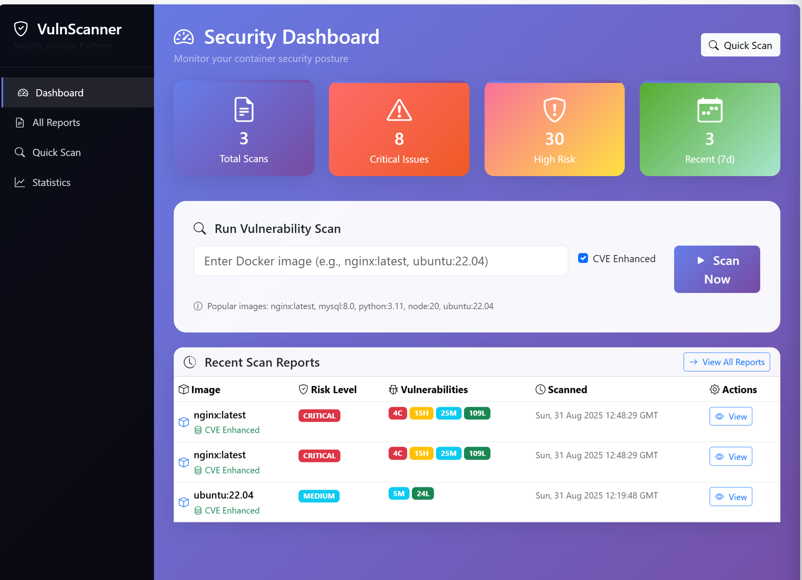
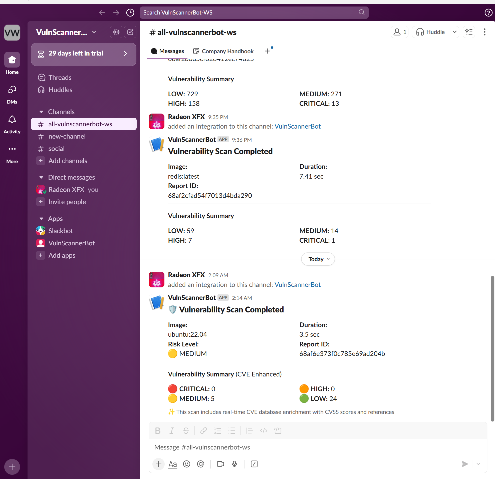

---

# 🛡️ CyberShield – Advanced Container Image Vulnerability Scanner

## 📌 Project Overview

CyberShield is a **capstone project** that scans Docker container images for vulnerabilities using known CVE databases, generates reports, and provides a **web-based dashboard** for analysis. It integrates with **CI/CD pipelines** and supports **Slack notifications** for real-time alerts.

---



## 🚀 Features

* 🔍 Automated vulnerability scanning for Docker images
* 📊 Web dashboard (Flask frontend) for viewing and analyzing scan reports
* 🗂️ Report storage in MongoDB
* 🔔 Slack notifications for high/critical vulnerabilities
* ⚙️ CI/CD integration with Jenkins & GitHub Actions
* 📦 Deployment automation with Terraform & Ansible

---

## 📂 Project Structure

```
CAPSTONE-vuln-scanner-with-Reporting-main/
├── ansible/                # Deployment automation
├── backend/                # API service for scanning
├── frontend/               # Dashboard UI
├── scanner/                # Trivy wrapper for scanning
├── reports/                # Stored scan results
├── terraform/              # Infrastructure as Code
├── jenkins/                # Jenkins pipeline
├── .env                    # Environment variables
└── Readme.md               # Project documentation
```

---

## ⚙️ Prerequisites

* Docker
* Python 3.9+ with `venv`
* MongoDB (local or Atlas)
* Slack Webhook URL
* Terraform & Ansible
* Jenkins (optional)

---

## 🛠️ Setup & Installation

### 1️⃣ Clone & Setup Environment

```bash
git clone https://github.com/your-repo/CyberShield.git
cd CyberShield
python3 -m venv venv
source venv/bin/activate
```

### 2️⃣ Install Dependencies

```bash
pip install -r backend/requirements.txt
pip install -r frontend/requirements.txt
```

### 3️⃣ Configure `.env`

```bash
SLACK_WEBHOOK_URL=<SLACK INCOMING NOTIFICATION URL>
MONGO_URI=<YOUR MONGO URI>
BACKEND_URL=http://172.30.0.123:5000
```

### 4️⃣ Run Backend & Frontend

```bash
cd backend && python app.py
cd frontend && python app.py
```

👉 Access Dashboard: `http://localhost:8080`

---

## 📡 Running a Scan

From the UI → enter a Docker image name (e.g., `nginx:latest`) → click **Initiate Scan**.
The scan results will be saved in MongoDB and shown on the dashboard.

---

## 📢 Slack Notifications Setup

### 🔎 Problem Analysis

1. Simply adding the Slack app **does not create a webhook**.
2. Backend `app.py` uses:

   ```python
   requests.post(SLACK_WEBHOOK_URL, json={"text": message})
   ```

   → Requires a valid webhook (`https://hooks.slack.com/services/...`).
3. If `.env` has wrong or empty values, no notification is sent.

### ✅ Fix – Create Incoming Webhook

1. Go to [https://api.slack.com/apps](https://api.slack.com/apps)
2. Create new app → “From Scratch” → `VulnScannerBot`
3. Enable **Incoming Webhooks** → ON
4. Add a webhook to your workspace
5. Copy generated URL into `.env`:

   ```env
   SLACK_WEBHOOK_URL=https://hooks.slack.com/services/XXXX/YYYY/ZZZZ
   ```
   

6. Restart backend:

   ```bash
   python3 backend/app.py
   ```
7. Run test scan:

   ```bash
   curl -X POST "http://172.30.0.123:5000/scan?image=nginx:latest"
   ```

### 🛠️ Debugging Step

```bash
curl -X POST -H 'Content-type: application/json' \
--data '{"text":"Hello from VulnScannerBot 🚀"}' \
https://hooks.slack.com/services/XXXX/YYYY/ZZZZ
```

If this works → notifications are set up correctly.

---

## 📌 Example Images to Scan

* `nginx:latest`
* `mysql:8.0`
* `alpine:latest`
* `node:20`
* `ubuntu:22.04`
* `python:3.11`
* `redis:latest`

---

## 📝 Future Enhancements

* Add RBAC to dashboard
* Grafana dashboards for trends
* Teams/email notification integration
* Kubernetes cluster-wide scanning

---

👉 Question: Do you want me to **patch `backend/app.py`** so it prints a clear message like *“Slack Webhook not configured”* if the variable is empty? That would make debugging easier.


